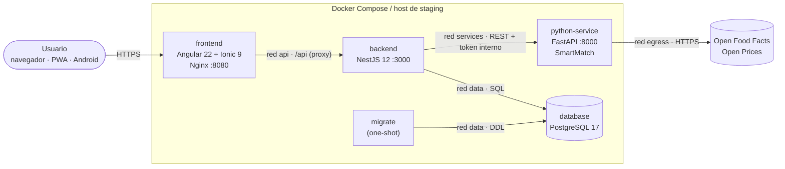

# SmartCommerce

[](https://github.com/Dakotahh1/SmartCommerce/actions/workflows/ci.yml)

> Plataforma **web, PWA y Android** que recomienda y compara productos de supermercado de forma **personalizada y explicable**, combinando calidad nutricional, procesamiento, impacto ambiental, precio, disponibilidad y preferencias con datos abiertos de **Open Food Facts**.

Proyecto de la asignatura **Ingeniería Web Avanzada** — Ingeniería Civil Informática · Área de aplicación: **comercio y servicios**.
**Entrega actual:** Entrega Parcial 1 — *Arquitectura y pipeline DevSecOps* (`v0.1.0-ep1`).

| Enlace | |
|---|---|
| 🎨 Prototipo navegable y design system | [Figma · SmartCommerce](https://www.figma.com/design/vUBipEZdpxUtfokgU17hKu) |
| ⚙️ Pipeline | [GitHub Actions](https://github.com/Dakotahh1/SmartCommerce/actions/workflows/ci.yml) |
| 📋 Tablero de gestión | *(agregar enlace al tablero del equipo)* |
| 🌐 Ambiente desplegado | Staging efímero en cada ejecución del pipeline; staging persistente definido con Terraform ([docs/09](docs/09-staging-terraform.md)) |

---

## Contenido

1. [Problema y propuesta](#1-problema-y-propuesta)
2. [Equipo](#2-equipo)
3. [Arquitectura](#3-arquitectura)
4. [Estructura del repositorio](#4-estructura-del-repositorio)
5. [Instalación y ejecución con Docker Compose](#5-instalación-y-ejecución-con-docker-compose)
6. [Desarrollo por componente](#6-desarrollo-por-componente)
7. [Pipeline DevSecOps](#7-pipeline-devsecops)
8. [Variables de entorno y secretos](#8-variables-de-entorno-y-secretos)
9. [API](#9-api)
10. [Infraestructura y staging](#10-infraestructura-y-staging)
11. [Pruebas](#11-pruebas)
12. [Guía de demostración EP1](#12-guía-de-demostración-ep1)
13. [Limitaciones y trabajo futuro](#13-limitaciones-y-trabajo-futuro)
14. [Documentación](#14-documentación)

---

## 1. Problema y propuesta

Comparar productos **solo por precio** es insuficiente: para elegir en el supermercado una persona debe equilibrar características, calidad nutricional (Nutri-Score, sellos **ALTO EN** de la Ley 20.606), nivel de procesamiento, impacto ambiental, precio por kilo, disponibilidad y sus propias restricciones (alérgenos, dietas). Esa información está **dispersa**, usa unidades distintas y no está personalizada.

**Problema delimitado.** Recomendar y comparar productos envasados de supermercado disponibles en Chile según las preferencias explícitas del consumidor (pesos por criterio), sus restricciones y su historial de interacción, con información obtenida y normalizada desde **Open Food Facts** y **Open Prices**, entregando una explicación verificable de cada recomendación.

| Usuarios | Necesidad |
|---|---|
| Visitante | Explorar el catálogo y comparar con puntajes generales |
| Consumidor (`user`) | Recomendaciones y comparaciones personalizadas y explicadas en segundos |
| Operador de datos (`operator`) | Ejecutar y auditar ingestas desde la fuente web |
| Administrador (`admin`) | Gestionar roles y supervisar el estado del sistema |

**Capacidad inteligente — motor SmartMatch** ([docs/05](docs/05-motor-smartmatch.md)):
1. *Filtros duros*: alérgenos excluidos, dietas y sellos ALTO EN.
2. *Puntaje multicriterio* 0–100 (nutrición, precio relativo a la categoría, procesamiento NOVA, Eco-Score, disponibilidad) con renormalización ante datos faltantes y confianza según cobertura.
3. *Adaptación*: ajustes acotados de pesos y afinidades aprendidos de favoritos, comparaciones y descartes, con decaimiento temporal; el usuario puede **desactivarla o restablecerla**.
4. *Explicación*: desglose por criterio, razones y advertencias; *estrategia base* no adaptativa para evaluar la mejora.

Detalle completo: [docs/01 · Definición del proyecto](docs/01-definicion-proyecto.md) · [docs/04 · Fuente web](docs/04-fuente-web.md).

## 2. Equipo

| Integrante | Rol principal | Responsabilidades |
|---|---|---|
| Diego Alvarado| Frontend y UX | Angular + Ionic + Capacitor, prototipo Figma, accesibilidad |
| Vicente Palma | Backend | NestJS, autenticación, API REST, PostgreSQL y migraciones |
| Vicente Palma | DevSecOps | Docker, pipeline de GitHub Actions, Terraform, seguridad |
| Lucas Pinto| Datos e inteligencia | Servicio Python, fuente web, motor SmartMatch |


El trabajo se organiza con **GitHub Flow**: ramas cortas por área, pull requests hacia `main` con plantilla y el check `Quality gate` obligatorio ([CONTRIBUTING.md](CONTRIBUTING.md), [ADR-0011](docs/adr/0011-estrategia-de-ramas-github-flow.md)).

## 3. Arquitectura



| Componente | Tecnología | Responsabilidad |
|---|---|---|
| `frontend` | Angular 22 (standalone, signals, zoneless) · Ionic 9 · Capacitor 8 · Nginx | UI web/PWA/Android, navegación adaptable, sesión segura, modo sin conexión, gateway `/api` con CSP |
| `backend` | NestJS 12 · TypeORM · PostgreSQL 17 · Pino · Swagger | Punto único de acceso: autenticación JWT + refresh rotativo, RBAC, validación DTO, negocio, persistencia, coordinación resiliente con Python |
| `python-service` | Python 3.13 · FastAPI · Pydantic v2 · httpx | Obtención, validación y normalización de datos web; motor SmartMatch; métricas de calidad |
| `database` | PostgreSQL 17 | Usuarios, preferencias, catálogo normalizado, procedencia, interacciones y registros de recomendación |

**Flujo principal (recomendaciones):** la app solicita `GET /api/v1/recommendations` → NestJS valida el JWT, lee preferencias, historial y candidatos de PostgreSQL → llama a `POST /v1/recommendations/rank` en FastAPI (timeout, reintentos, circuit breaker, contrato validado con zod) → guarda el registro de recomendación → responde con puntajes y explicaciones. Si Python no está disponible, NestJS responde con un **ranking base de respaldo** marcado `degraded: true`.

Diagramas C4, despliegue y secuencias: [docs/02 · Arquitectura](docs/02-arquitectura.md) · Modelo de datos: [docs/03](docs/03-modelo-datos.md) · Decisiones: [ADR](docs/adr/README.md).

## 4. Estructura del repositorio

```
SmartCommerce/
├── frontend/                 # Angular + Ionic + Capacitor (PWA y proyecto Android) · Dockerfile Nginx
├── backend/                  # NestJS: módulos, entidades, migraciones, pruebas unitarias y e2e · Dockerfile
├── python-service/           # FastAPI: fuente web, normalización, motor SmartMatch, pruebas · Dockerfile
├── infra/
│   ├── docker/postgres/init/ # roles de mínimo privilegio para PostgreSQL
│   └── terraform/            # módulo del stack + ambientes dev y staging
├── scripts/                  # init-env, smoke-test, network-isolation-test, resilience-test, promote-user
├── docs/                     # definición, arquitectura, datos, fuente web, motor, seguridad, pipeline, variables, staging, ADR
├── .github/                  # workflow CI DevSecOps, Dependabot, plantilla de PR
├── docker-compose.yml        # ambiente local integrado
└── .env.example              # variables para Docker Compose (sin secretos reales)
```

## 5. Instalación y ejecución con Docker Compose

**Requisitos:** Docker Engine 24+ con Docker Compose v2 (Docker Desktop en Windows/macOS), Git y Bash (Git Bash en Windows). Conexión a Internet para la ingesta desde Open Food Facts.

```bash
git clone https://github.com/Dakotahh1/SmartCommerce.git
cd SmartCommerce

# 1. Variables: crea .env con secretos aleatorios (nunca se versiona)
scripts/init-env.sh

# 2. Construir y levantar todo (database → migrate → python-service → backend → frontend)
docker compose up -d --build
docker compose ps            # todos "healthy"; migrate "exited (0)"

# 3. Abrir la aplicación
#    App:      http://localhost:8080
#    Swagger:  http://localhost:8080/api/docs
#    Salud:    http://localhost:8080/api/health
```

**Poblar el catálogo** (la ingesta está restringida a `admin`/`operator`):

```bash
# a) Registrarse en la app (http://localhost:8080/auth/registro) y promover la cuenta:
scripts/promote-user.sh tu@correo.cl admin
# b) Cerrar sesión y volver a entrar (el rol viaja en el token), luego ir a Administración › Ingesta
#    y ejecutar, por ejemplo: país "chile", categoría "breakfast-cereals", 50 productos.
```

**Verificación automática del stack local:**

```bash
scripts/smoke-test.sh                 # flujo mínimo + controles de seguridad
scripts/network-isolation-test.sh     # segmentación de red
scripts/resilience-test.sh            # fallo controlado de Python y PostgreSQL
```

**Detener:** `docker compose down` (conserva datos) · `docker compose down -v` (borra el volumen).

| Servicio | Puerto | Expuesto al host | Redes |
|---|---|---|---|
| frontend | 8080 | Sí (solo `127.0.0.1` por defecto) | `edge`, `api` |
| backend | 3000 | No | `api`, `services`, `data` |
| python-service | 8000 | No | `services`, `egress` |
| database | 5432 | No | `data` |

## 6. Desarrollo por componente

| Componente | Requisitos | Comandos |
|---|---|---|
| Frontend | Node 24 LTS, npm 11 | `cd frontend && npm ci && npm start` → http://localhost:4200 (API en `http://localhost:3000/api`) |
| Backend | Node 24 LTS, PostgreSQL 17 | `cd backend && npm ci && cp .env.example .env` (completar) `&& npm run build && npm run migration:run && npm run start:dev` |
| Python | Python 3.13, [uv](https://docs.astral.sh/uv/) | `cd python-service && uv sync && cp .env.example .env && uv run --env-file .env uvicorn --factory app.main:create_app --reload --port 8000` |
| Android | Android Studio (SDK 36), JDK 21 | `cd frontend && npm run build:android && npx cap open android` |

Guías específicas: [frontend/README.md](frontend/README.md) · [backend/README.md](backend/README.md) · [python-service/README.md](python-service/README.md).

## 7. Pipeline DevSecOps

Workflow [`ci.yml`](.github/workflows/ci.yml) en cada pull request y push a `main`. Cada etapa depende de la anterior y un **quality gate** único bloquea la integración si algo falla.

| Etapa | Controles | Bloquea si… |
|---|---|---|
| 1. Seguridad del repositorio | **gitleaks** (historial completo) · **Semgrep** (OWASP, TS, Python, Docker, Actions) · **hadolint** · **ShellCheck** · **actionlint** · `docker compose config` | Secreto, hallazgo SAST alto o configuración inválida |
| 2. Componentes | `npm ci` / `uv sync --frozen` · ESLint/oxlint/Ruff · Prettier/Ruff format · `tsc`/mypy estricto · Vitest/pytest con cobertura · build · e2e con PostgreSQL real · **npm audit** · **pip-audit** · **Bandit** · APK Android | Error de lint, tipos, pruebas, build o dependencia vulnerable (alta/crítica) |
| 3. Contenedores | Build de las 3 imágenes · verificación de usuario no root · **Trivy** · SBOM CycloneDX | Imagen root o vulnerabilidad CRITICAL/HIGH con parche |
| 4. Staging efímero | Docker Compose con las imágenes escaneadas · pruebas de humo (incl. 401/403/400) · aislamiento de red · resiliencia | Cualquier prueba falla |
| 4. Terraform | `fmt` · `validate` (dev y staging) · `plan` de staging | Formato, validación o plan inválidos |
| 5. Quality gate | Resume todas las etapas | Alguna etapa no terminó en éxito |
| 6. Publicación | Imágenes en GHCR (`sha-<commit>`, `main`, versión) | Solo en `main`/tags tras el gate |

Seguridad del pipeline: permisos `contents: read` por defecto, acciones fijadas por SHA, binarios con SHA-256 verificado, secretos por ambiente enmascarados y Dependabot. Detalle, evidencias de bloqueo y protección de `main`: [docs/07 · Pipeline DevSecOps](docs/07-pipeline-devsecops.md).

## 8. Variables de entorno y secretos

| Dónde | No sensibles | Sensibles |
|---|---|---|
| Local / Compose | `.env` (desde [`.env.example`](.env.example)) | `.env` (ignorado por git; `scripts/init-env.sh` genera valores aleatorios) |
| GitHub Actions | **Variables**: `APP_VERSION`, `OFF_USER_AGENT`, `SMOKE_INGEST`, `TRIVY_SEVERITY`, `STAGING_DOCKER_HOST` | **Secrets** (ambiente `staging`): `POSTGRES_SUPERUSER_PASSWORD`, `DB_OWNER_PASSWORD`, `DB_APP_PASSWORD`, `JWT_ACCESS_SECRET`, `INTERNAL_API_TOKEN` |
| Terraform | `environments/<ambiente>/terraform.tfvars` | `TF_VAR_*` |

Variables requeridas por Docker Compose:

| Variable | Tipo | Descripción |
|---|---|---|
| `POSTGRES_SUPERUSER_PASSWORD` | Secreto | Solo para inicializar PostgreSQL |
| `DB_OWNER_PASSWORD` | Secreto | Rol dueño del esquema (migraciones) |
| `DB_APP_PASSWORD` | Secreto | Rol de la API (solo DML) |
| `JWT_ACCESS_SECRET` | Secreto (≥ 32) | Firma de access tokens |
| `INTERNAL_API_TOKEN` | Secreto (≥ 32) | Autenticación NestJS → FastAPI |
| `APP_ENV`, `APP_VERSION`, `LOG_LEVEL` | Variable | Ambiente, versión y logs |
| `FRONTEND_BIND`, `FRONTEND_PORT`, `CORS_ORIGINS` | Variable | Exposición del gateway y orígenes permitidos |
| `OFF_USER_AGENT`, `OFF_*` | Variable | Identificación y límites hacia Open Food Facts |

Tabla completa, mínimo privilegio y configuración paso a paso en GitHub: [docs/08 · Variables y secretos](docs/08-variables-y-secretos.md).

## 9. API

Documentación interactiva **OpenAPI/Swagger**: `http://localhost:8080/api/docs` (JSON en `/api/docs-json`).

| Método | Ruta | Acceso | Descripción |
|---|---|---|---|
| POST | `/api/v1/auth/register` · `/login` · `/refresh` | Público (rate limit) | Registro, inicio de sesión y rotación de refresh token |
| POST · GET · DELETE | `/api/v1/auth/logout` · `/me` | Autenticado | Cierre de sesión, perfil y eliminación de cuenta |
| GET · PUT | `/api/v1/me/preferences` | Autenticado | Preferencias de personalización |
| GET | `/api/v1/products` · `/products/:id` · `/categories` | Público | Catálogo con búsqueda y filtros |
| POST · GET · DELETE | `/api/v1/interactions` · `/me/interactions` · `/me/favorites` | Autenticado | Comportamiento, historial y aprendizaje |
| GET | `/api/v1/recommendations` | Autenticado | Recomendaciones SmartMatch explicables |
| POST | `/api/v1/comparisons` | Público (personalizada con sesión) | Comparación de 2–4 productos |
| GET · POST | `/api/v1/admin/ingestions` | `admin`, `operator` | Ingestas desde Open Food Facts con reporte de calidad |
| GET · PATCH | `/api/v1/admin/users` | `admin` | Gestión de roles |
| GET | `/api/health` · `/api/health/live` · `/api/health/metrics` | Público / `admin`,`operator` | Salud agregada y métricas por ruta |

Errores con formato uniforme `{ statusCode, code, message, details, path, timestamp, requestId }` y correlación extremo a extremo con `X-Request-Id`. Contratos internos del servicio Python: [python-service/README.md](python-service/README.md).

## 10. Infraestructura y staging

- **Terraform** con proveedor `kreuzwerker/docker` ([ADR-0010](docs/adr/0010-terraform-proveedor-docker-staging.md)): módulo `smartcommerce-stack` (redes segmentadas, volumen, imágenes y contenedores endurecidos) y ambientes `dev` y `staging` con variables, salidas y estado fuera del repositorio.
- `terraform fmt`, `validate` y `plan` se ejecutan en el pipeline.
- **Staging:** VM Linux con Docker accesible por SSH, imágenes inmutables desde GHCR, gateway detrás de un proxy TLS y secretos del ambiente `staging` de GitHub.

```bash
cd infra/terraform/environments/staging
terraform init && terraform validate
terraform plan -var "image_tag=sha-<commit>"      # requiere TF_VAR_* con los secretos
```

Detalle: [docs/09 · Infraestructura y staging](docs/09-staging-terraform.md).

## 11. Pruebas

| Componente | Herramientas | Alcance |
|---|---|---|
| Frontend | Vitest + TestBed | Sesión y refresh, interceptores, guards, formulario de login, contratos HTTP, store de comparación, componentes |
| Backend | Vitest (unitarias) + e2e con PostgreSQL real | Auth y rotación de tokens, RBAC, validación, cliente resiliente de SmartMatch, migraciones up/down, flujo HTTP completo con servicio Python simulado |
| Python | pytest + respx (cobertura ≥ 85 %) | Conector Open Food Facts, normalización y calidad, sellos Ley 20.606, motor y explicaciones, API y errores |
| Integración | `scripts/*.sh` en el staging efímero | Flujo mínimo, controles de seguridad, aislamiento de red y resiliencia |

## 12. Guía de demostración EP1

1. **Componentes corriendo:** `docker compose up -d --build` y `docker compose ps` (todos *healthy*).
2. **Navegación:** abrir http://localhost:8080 → bienvenida → explorar → detalle → comparar; en escritorio se ve el menú lateral y en móvil (DevTools) la barra inferior.
3. **Angular → NestJS:** iniciar sesión y abrir *Para ti*; en DevTools › Network se ve `GET /api/v1/recommendations` con `X-Request-Id`.
4. **NestJS → FastAPI:** `http://localhost:8080/api/health` muestra `smartmatch: up`; la ingesta desde *Administración* pasa por Python hasta Open Food Facts.
5. **NestJS ↔ PostgreSQL:** los productos ingeridos aparecen en *Explorar*; `docker compose exec database psql -U postgres -d smartcommerce -c "select count(*) from products"`.
6. **Pipeline en GitHub Actions:** mostrar la última ejecución con el resumen del quality gate, reportes de Trivy/Semgrep y el APK como artefacto.
7. **Fallo controlado:**
   - `docker compose stop python-service` → *Para ti* muestra el aviso de modo degradado y recomendaciones de respaldo; `docker compose start python-service` lo recupera.
   - Abrir un PR con un secreto ficticio o una prueba rota: el pipeline se detiene y el quality gate impide integrar ([docs/07 §7.5](docs/07-pipeline-devsecops.md#75-evidencia-de-bloqueo)).

## 13. Limitaciones y trabajo futuro

**Limitaciones actuales (EP1)**
- Precios colaborativos de Open Prices con baja cobertura en Chile: el criterio de precio se omite y se renormaliza cuando falta el dato.
- La adaptación usa reglas acotadas y transparentes; aún no hay evaluación experimental con usuarios.
- El staging persistente está definido en Terraform pero no desplegado; el pipeline valida cada versión en un staging efímero.
- Sin iOS ni notificaciones push; la PWA cachea solo lecturas.

**Trabajo futuro**
- EP2: ingestas programadas y deduplicación avanzada, despliegue automático a staging con aprobación y rollback, observabilidad (métricas y trazas), pruebas E2E de interfaz.
- Entrega final: evaluación del motor (Precision@5 personalizada vs. base), pruebas de usabilidad y accesibilidad WCAG AA, publicación del APK firmado.

## 14. Documentación

| Documento | Contenido |
|---|---|
| [01 · Definición del proyecto](docs/01-definicion-proyecto.md) | Problema, usuarios, objetivos, alcance, funcionalidades |
| [02 · Arquitectura](docs/02-arquitectura.md) | Diagramas C4, despliegue y flujos |
| [03 · Modelo de datos](docs/03-modelo-datos.md) | Modelo conceptual y lógico, migraciones, roles de BD |
| [04 · Fuente web](docs/04-fuente-web.md) | Open Food Facts / Open Prices: obtención, calidad, licencias |
| [05 · Motor SmartMatch](docs/05-motor-smartmatch.md) | Capacidad adaptativa y plan de evaluación |
| [06 · Seguridad y privacidad](docs/06-seguridad-privacidad.md) | RBAC, STRIDE, privacidad, controles automáticos |
| [07 · Pipeline DevSecOps](docs/07-pipeline-devsecops.md) | Etapas, quality gates, evidencias de bloqueo |
| [08 · Variables y secretos](docs/08-variables-y-secretos.md) | Configuración por ambiente y mínimo privilegio |
| [09 · Infraestructura y staging](docs/09-staging-terraform.md) | Terraform, ambiente de staging |
| [ADR](docs/adr/README.md) | Registro de decisiones de arquitectura |
| [CONTRIBUTING](CONTRIBUTING.md) | Flujo de ramas, commits y pull requests |

---

Datos de productos © colaboradores de Open Food Facts, bajo licencia [ODbL](https://opendatacommons.org/licenses/odbl/1-0/); imágenes bajo CC BY-SA. Código bajo licencia [MIT](LICENSE).
