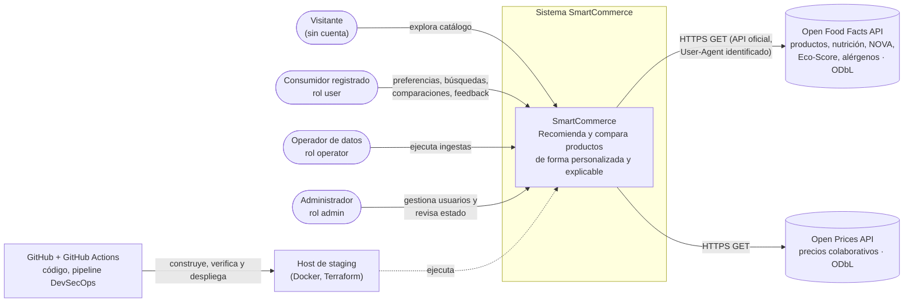
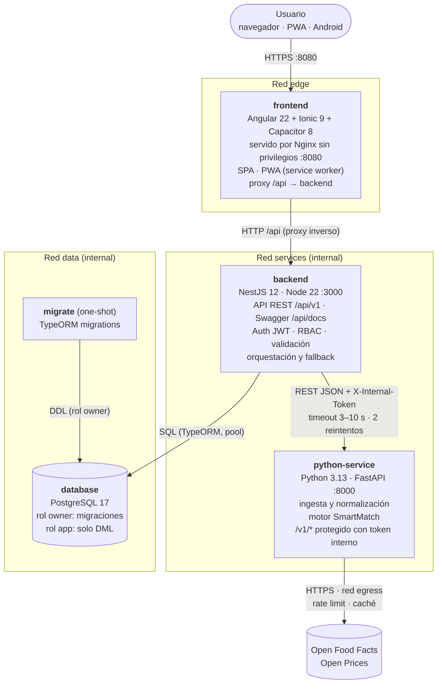
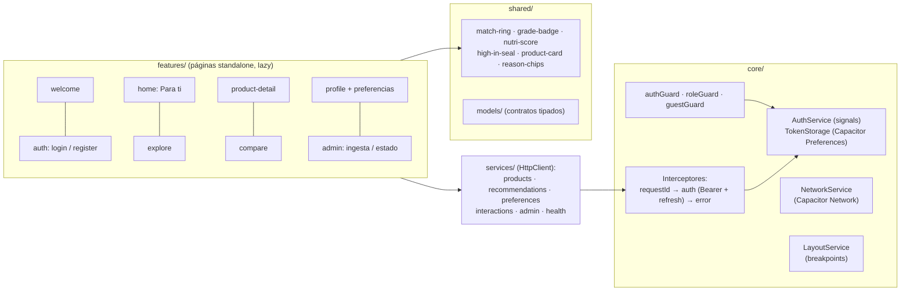
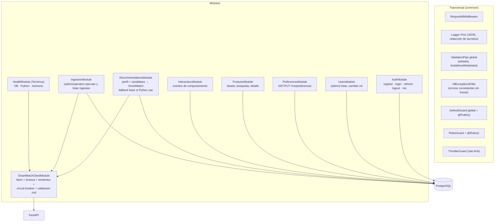
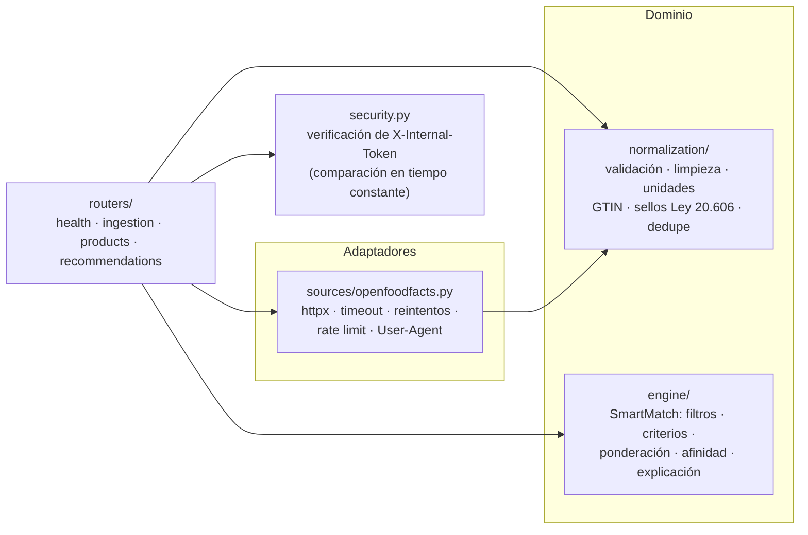
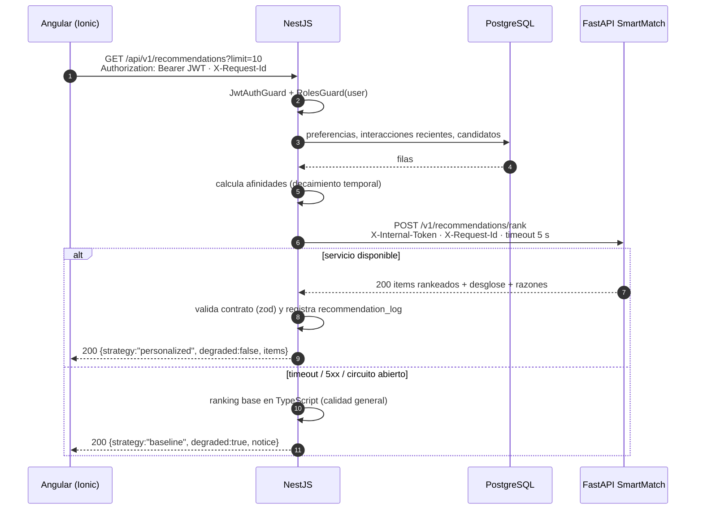
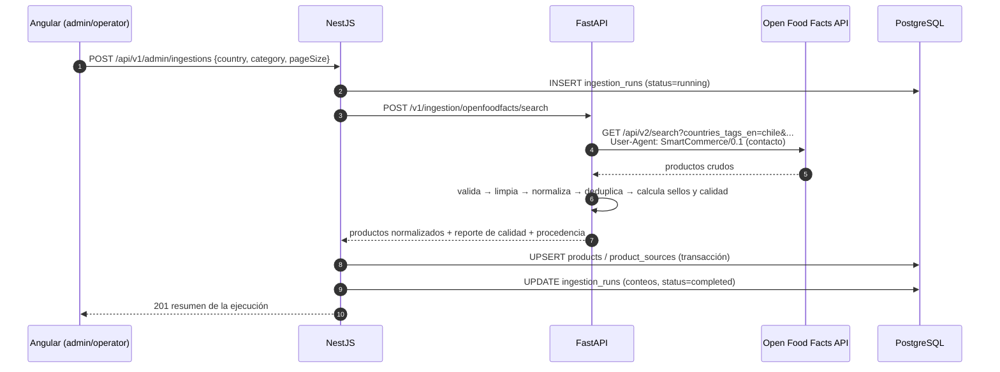
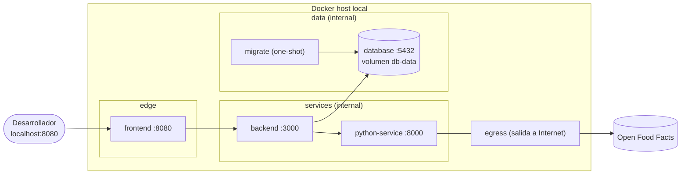
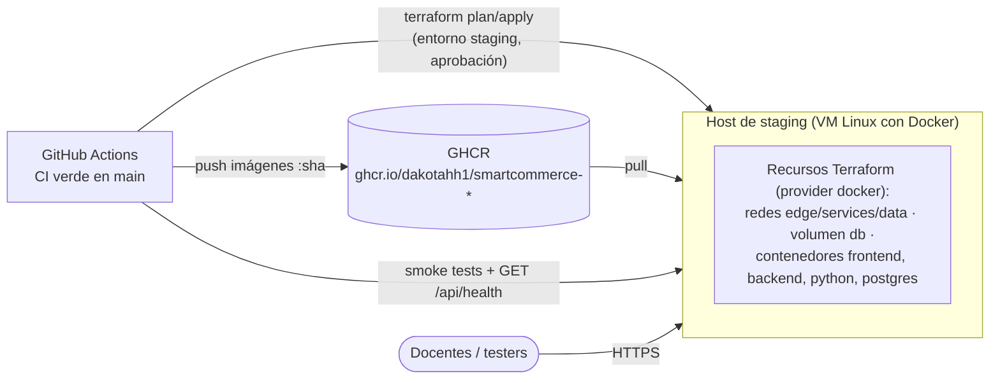

# 2. Arquitectura

> Modelo C4 (contexto → contenedores → componentes) + despliegue + flujos. Las decisiones se justifican en los [ADR](adr/README.md).

## 2.1 Vista general

```
Ionic + Angular + Capacitor  (navegador · PWA · Android)
                │  HTTPS / REST + JWT
                ▼
     API REST principal NestJS  ──────────────►  PostgreSQL 17
                │  REST interno + token de servicio
                ▼
      Servicio SmartMatch (Python + FastAPI) ──►  Open Food Facts / Open Prices (Web)
```

Reglas de la arquitectura (sección 3 del enunciado):

1. El frontend **solo** se comunica con NestJS. Nunca accede a Python ni a la base de datos.
2. NestJS es el **único dueño** de PostgreSQL (TypeORM + migraciones). Python **no** tiene credenciales de base de datos: recibe los datos que necesita en el contrato de cada solicitud.
3. Python es **sin estado**: obtiene información web, la normaliza y ejecuta el motor SmartMatch.
4. Cada componente corre en su **propio contenedor**, se comunica por **nombre de servicio** y se configura por **variables de entorno**.

## 2.2 Diagrama de contexto (C4 nivel 1)



## 2.3 Diagrama de contenedores (C4 nivel 2)



| Contenedor | Tecnología | Responsabilidad | Expone |
|---|---|---|---|
| `frontend` | Angular 22, Ionic 9, Capacitor 8, Nginx | UI multiplataforma, PWA, proxy `/api` | `8080` (único puerto público) |
| `backend` | NestJS 12, TypeORM, Pino, Terminus | API REST, autenticación/autorización, negocio, persistencia, coordinación con Python, salud | `3000` (solo redes internas) |
| `python-service` | FastAPI, Pydantic v2, httpx | Obtención y normalización de datos web, motor SmartMatch | `8000` (solo red `services`) |
| `database` | PostgreSQL 17 | Persistencia relacional | `5432` (solo red `data`) |
| `migrate` | Imagen del backend | Ejecuta migraciones con rol propietario y termina | — |

## 2.4 Componentes (C4 nivel 3)

### 2.4.1 Frontend (Angular + Ionic)



- Navegación: **pestañas inferiores en móvil** e **`ion-split-pane` con menú lateral en escritorio (≥ 992 px)**.
- Estado reactivo con **Signals** (sesión, preferencias, comparación en curso) y **RxJS** para HTTP.
- Formularios **reactivos** con validaciones sincrónicas.
- PWA: `@angular/service-worker`, manifiesto, íconos, caché de assets y de lecturas (`/api/v1/products`, recomendaciones) con estrategia *freshness*.

### 2.4.2 Backend NestJS



### 2.4.3 Servicio Python (FastAPI)



## 2.5 Flujos principales

### 2.5.1 Recomendaciones personalizadas (Angular → NestJS → Python → NestJS → Angular)



### 2.5.2 Ingesta desde la fuente web



### 2.5.3 Autenticación

```mermaid
sequenceDiagram
    autonumber
    participant A as Angular
    participant N as NestJS
    participant D as PostgreSQL
    A->>N: POST /api/v1/auth/login {email, password}
    N->>D: busca usuario por email
    N->>N: argon2id.verify(hash, password)
    N->>D: guarda hash SHA-256 del refresh token (familia, expiración)
    N-->>A: accessToken (JWT 15 min) + refreshToken (opaco 7 días)
    Note over A: interceptor agrega Bearer; ante 401 usa /auth/refresh una vez
    A->>N: POST /api/v1/auth/refresh {refreshToken}
    N->>D: valida hash, revoca el anterior, emite uno nuevo (rotación)
    N-->>A: nuevos tokens
    A->>N: POST /api/v1/auth/logout {refreshToken}
    N->>D: revoca la familia de tokens
```

## 2.6 Despliegue

### 2.6.1 Local (Docker Compose)



Orden de arranque controlado con `depends_on` + `healthcheck`: `database (healthy)` → `migrate (completed)` + `python-service (healthy)` → `backend (healthy)` → `frontend`.

### 2.6.2 Staging (preliminar)



Detalle en [09-staging-terraform.md](09-staging-terraform.md) (rama de infraestructura). El despliegue definitivo no se exige en EP1; el pipeline sí levanta un **staging efímero** con las imágenes construidas y ejecuta pruebas de salud y de humo antes de aprobar.

## 2.7 Aspectos transversales

| Aspecto | Decisión |
|---|---|
| Configuración | Variables de entorno validadas al arrancar (Joi en NestJS, Pydantic Settings en Python); `.env.example` por servicio |
| Observabilidad | Logs JSON (Pino / structlog) con `requestId` propagado Angular → NestJS → Python; `/api/health` agregado; métricas de latencia por request |
| Errores | Formato uniforme `{statusCode, code, message, details, requestId, timestamp, path}` sin trazas internas |
| Seguridad | Helmet, CORS restringido, rate limiting, validación estricta, JWT corto + refresh rotativo, RBAC, token entre servicios, contenedores sin root, redes internas, mínimo privilegio en BD |
| Resiliencia | Timeouts, reintentos acotados con backoff, circuit breaker y respuesta degradada |
| Versionado de API | Prefijo `/api/v1` (URI versioning de NestJS) |
