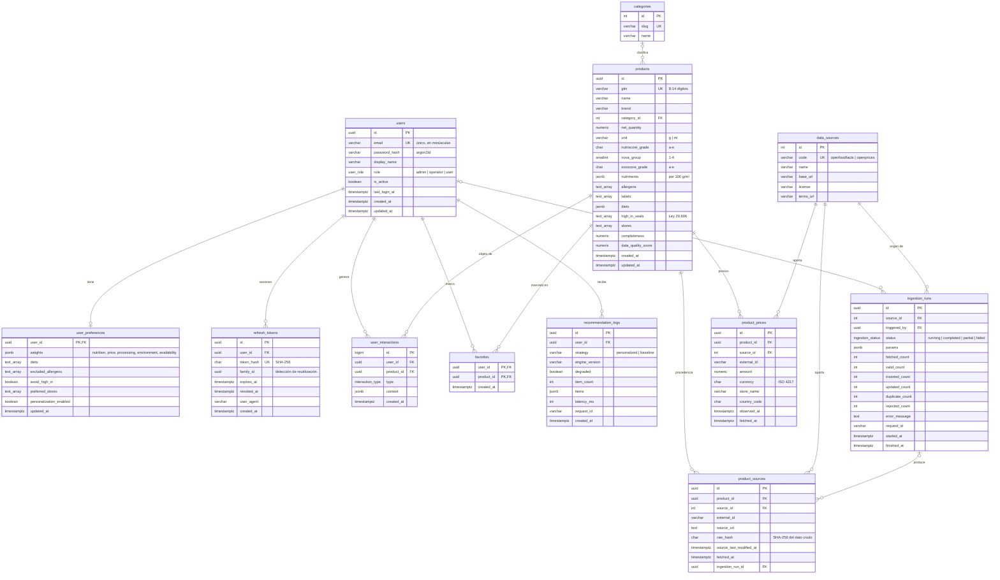

# 3. Modelo de datos

> PostgreSQL 17 administrado **exclusivamente por NestJS** mediante TypeORM y migraciones versionadas. Python no accede a la base de datos (ver [ADR-0003](adr/0003-nestjs-api-principal-python-servicio-especializado.md)).

## 3.1 Modelo conceptual

| Entidad | Descripción |
|---|---|
| **Usuario** | Persona con cuenta y un rol (`admin`, `operator`, `user`). El visitante no se persiste. |
| **Token de refresco** | Sesión revocable de un usuario (rotación por familia). |
| **Preferencias** | Pesos por criterio, dietas, alérgenos excluidos, evitar sellos y activación de la personalización (1:1 con usuario). |
| **Fuente de datos** | Origen web de la información (Open Food Facts, Open Prices) con licencia y términos. |
| **Categoría** | Clasificación normalizada de productos. |
| **Producto** | Producto normalizado identificado por su GTIN (EAN/UPC). |
| **Procedencia de producto** | Registro de qué fuente aportó el producto, cuándo, con qué hash del dato crudo y en qué ingesta. |
| **Precio de producto** | Observación de precio (fuente, tienda, moneda, fecha). |
| **Ejecución de ingesta** | Traza de cada proceso de obtención: parámetros, estado y métricas de calidad. |
| **Interacción** | Evento de comportamiento del usuario sobre un producto (vista, favorito, comparación, descarte…). |
| **Favorito** | Producto marcado por un usuario. |
| **Registro de recomendación** | Traza de cada recomendación entregada (estrategia, versión del motor, degradación, latencia). |

Relaciones clave: un usuario tiene **1** preferencia, **N** tokens, **N** interacciones, **N** favoritos y **N** registros de recomendación; un producto pertenece a **0..1** categoría y tiene **N** procedencias, **N** precios e **N** interacciones; una fuente tiene **N** ingestas, procedencias y precios; una ingesta genera **N** procedencias.

## 3.2 Modelo lógico (diagrama entidad-relación)



## 3.3 Descripción de tablas

| Tabla | Propósito | Restricciones e índices relevantes |
|---|---|---|
| `users` | Cuentas y rol | `email` único (índice sobre `lower(email)`); `role` enum; `is_active` para bloqueo lógico |
| `refresh_tokens` | Sesiones revocables | `token_hash` único; FK `user_id ON DELETE CASCADE`; índice `(user_id)`; nunca se guarda el token en claro |
| `user_preferences` | Perfil explícito del usuario | PK = FK a `users` (1:1, cascade); `CHECK` de pesos entre 0 y 100 validado en DTO |
| `data_sources` | Catálogo de fuentes web con licencia | `code` único; se siembra en la migración inicial |
| `categories` | Categorías normalizadas | `slug` único |
| `products` | Producto normalizado | `gtin` único (deduplicación); `CHECK` en `nutriscore_grade`, `ecoscore_grade` (`a`–`e`), `nova_group` (1–4), `unit` (`g`,`ml`); índice GIN de texto completo en español sobre nombre y marca; GIN en `allergens`; índice en `category_id` |
| `product_sources` | **Procedencia** y detección de cambios | `UNIQUE (source_id, external_id)`; `raw_hash` para saber si el dato cambió; FK a `ingestion_runs ON DELETE SET NULL` |
| `product_prices` | Observaciones de precio | `CHECK amount > 0`; `UNIQUE (source_id, external_id)`; índice `(product_id, observed_at DESC)` |
| `ingestion_runs` | Trazabilidad de cada ingesta y métricas de calidad | enum de estado; `params` JSONB; `request_id` para correlacionar logs |
| `user_interactions` | Señales de comportamiento para la adaptación | enum de tipo; índice `(user_id, created_at DESC)` e índice `(product_id)` |
| `favorites` | Favoritos | PK compuesta `(user_id, product_id)` evita duplicados |
| `recommendation_logs` | Auditoría y evaluación (comparación con base no adaptativa) | índice `(user_id, created_at DESC)` |

Todas las marcas de tiempo usan `timestamptz` (UTC). Las claves primarias son UUID generadas con `gen_random_uuid()` (nativo desde PostgreSQL 13), salvo tablas de catálogo pequeñas (`serial`) y `user_interactions` (`bigint identity`, alto volumen).

## 3.4 Estrategia de migraciones

- **TypeORM migrations** en `backend/src/database/migrations/`, escritas en SQL explícito para que sean revisables en los pull requests.
- `synchronize: false` en todos los ambientes: el esquema **solo** cambia por migraciones.
- Nombres con marca de tiempo (`<timestamp>-<Descripcion>.ts`); cada migración implementa `up` y `down`.
- Se ejecutan en un contenedor **one-shot `migrate`** con el rol propietario, antes de que arranque el backend (que usa un rol sin permisos DDL).
- En CI, las pruebas de integración levantan PostgreSQL, ejecutan todas las migraciones `up` y luego `down` para verificar reversibilidad.
- Cambios incompatibles se hacen en dos pasos (expandir → migrar datos → contraer) para permitir **rollback** de la aplicación sin perder datos.

## 3.5 Mínimo privilegio en la base de datos

| Rol PostgreSQL | Usado por | Permisos |
|---|---|---|
| `postgres` (superusuario de la imagen) | Solo inicialización del contenedor | Crea roles y base de datos (script `infra/docker/postgres/init`) |
| `smartcommerce_owner` | Contenedor `migrate` | Dueño del esquema `public`: DDL |
| `smartcommerce_app` | Backend NestJS | `SELECT, INSERT, UPDATE, DELETE` en tablas y `USAGE` en secuencias (privilegios por defecto); **sin** DDL |

## 3.6 Inicialización de la base de datos

```bash
# 1) Copiar variables de ejemplo y definir contraseñas propias
cp .env.example .env

# 2) Levantar PostgreSQL (el script de init crea los roles owner y app)
docker compose up -d database

# 3) Ejecutar migraciones (servicio one-shot)
docker compose run --rm migrate

# 4) (Opcional) Poblar el catálogo desde Open Food Facts como admin:
#    POST /api/v1/admin/ingestions  {"country":"chile","category":"breakfast-cereals","pageSize":50}
```

En desarrollo sin Docker: `cd backend && npm run migration:run` con las variables `DB_*` apuntando a una instancia local.
