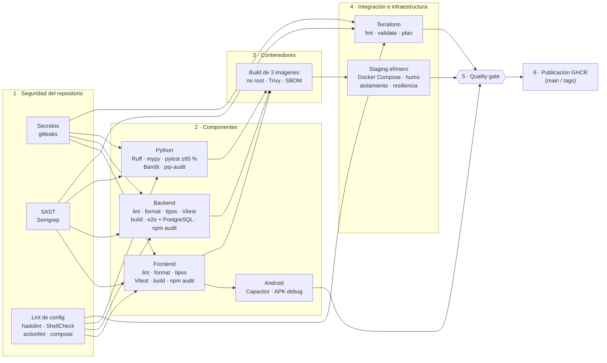

# 7. Pipeline DevSecOps

> Workflow: [`.github/workflows/ci.yml`](../.github/workflows/ci.yml) · Decisión: [ADR-0009](adr/0009-pipeline-devsecops-github-actions.md) · Variables y secretos: [08-variables-y-secretos.md](08-variables-y-secretos.md)

El pipeline responde a la pregunta de la EP1 —*¿cómo se construye, verifica, protege y despliega la solución de forma automatizada y reproducible?*— con etapas encadenadas: **una etapa solo se ejecuta si las anteriores pasaron**, y un único check final (`Quality gate`) resume el resultado para proteger la rama `main`.

## 7.1 Disparadores

| Evento | Qué ejecuta |
|---|---|
| `pull_request` hacia `main` | Todas las etapas de verificación (1 a 5). Nuevos commits cancelan la ejecución anterior del mismo PR |
| `push` a `main` | Etapas 1 a 5 + publicación de imágenes en GHCR (`sha-<commit>` y `main`) |
| `push` de tag `v*` (release) | Etapas 1 a 5 + publicación con la versión (`0.1.0`, …) |
| `workflow_dispatch` | Ejecución manual para demostraciones |

## 7.2 Etapas



| # | Job | Controles | Falla si… |
|---|---|---|---|
| 1 | **Secretos (gitleaks)** | Escanea **todo el historial** con reglas por defecto y lista blanca mínima ([`.gitleaks.toml`](../.gitleaks.toml)) | Hay cualquier secreto |
| 1 | **SAST (Semgrep)** | Reglas OWASP Top 10, TypeScript, Node.js, Python, Dockerfile, GitHub Actions y secretos; reporte SARIF | Hay hallazgos de severidad `ERROR` |
| 1 | **Lint de configuración** | hadolint (Dockerfiles, umbral `info`), ShellCheck (scripts), actionlint (workflows), `docker compose config` | Cualquier hallazgo o compose inválido |
| 2 | **Frontend** | `npm ci` · ESLint (incl. accesibilidad) · Prettier · `tsc` · Vitest con cobertura · build PWA · `npm audit` | Error de lint/tipos/pruebas/build o vulnerabilidad alta/crítica |
| 2 | **Backend** | `npm ci` · oxlint · Prettier · `tsc` · Vitest con cobertura · build · pruebas e2e con PostgreSQL 17 real (migraciones up → down → up) · `npm audit` | Idem |
| 2 | **Servicio Python** | `uv sync --frozen` · Ruff (incl. reglas de seguridad) · formato · mypy estricto · pytest con cobertura mínima 85 % · Bandit · pip-audit | Idem o cobertura < 85 % |
| 2 | **Android** | Build `android` + `cap sync` + `./gradlew assembleDebug`; publica el APK como artefacto | La app no compila para Android |
| 3 | **Imágenes** (matriz ×3) | Build con Buildx y caché · verificación de usuario **no root** · Trivy (vulnerabilidades con parche) · SBOM CycloneDX · reporte JSON | Imagen como root o vulnerabilidad CRITICAL/HIGH con parche |
| 4 | **Staging efímero** | `docker compose up` con **las mismas imágenes escaneadas** · [`smoke-test.sh`](../scripts/smoke-test.sh) · [`network-isolation-test.sh`](../scripts/network-isolation-test.sh) · [`resilience-test.sh`](../scripts/resilience-test.sh) · logs como artefacto si falla · `down -v` siempre | Cualquier prueba falla |
| 4 | **Terraform** | `terraform fmt -check` · `init -lockfile=readonly` + `validate` de `dev` y `staging` · `plan` de staging contra el daemon Docker del runner con secretos del ambiente `staging` (o efímeros); plan legible como artefacto | Formato, validación o plan inválidos (ver [09](09-staging-terraform.md)) |
| 5 | **Quality gate** | Evalúa el resultado de todas las etapas y publica una tabla en el resumen | Alguna etapa no terminó en `success` (incluye `skipped` por un fallo previo) |
| 6 | **Publicación** | `docker push` a `ghcr.io/<owner>/smartcommerce-<servicio>` con `packages: write` solo en este job | — |

### Pruebas del staging efímero

| Script | Qué demuestra |
|---|---|
| `smoke-test.sh` | Flujo mínimo EP1 por el gateway: SPA y cabeceras de seguridad → `/api/health` (NestJS ↔ PostgreSQL y NestJS ↔ FastAPI) → catálogo → registro → preferencias → recomendaciones → ingesta real desde Open Food Facts → comparación → logout. **Controles negativos**: sin token (401), token manipulado (401), rol insuficiente (403), datos inválidos (400 con formato de error uniforme), campos no permitidos (400), contraseña incorrecta (401), refresh revocado (401) |
| `network-isolation-test.sh` | Solo el gateway es accesible desde el host; el gateway no alcanza Python ni PostgreSQL; la API no tiene salida a Internet; Python no alcanza PostgreSQL |
| `resilience-test.sh` | **Fallo controlado**: se detiene Python → la API responde `degraded` y recomienda con el ranking base de respaldo; vuelve Python → `ok`. Se detiene PostgreSQL → `/api/health` 503 sin detalles internos; vuelve → la API reconecta sola |

## 7.3 Seguridad del propio pipeline

- `permissions: contents: read` a nivel de workflow; solo `publish` obtiene `packages: write`.
- Todas las acciones de terceros **fijadas por SHA de commit** (con la versión en comentario) y actualizadas por Dependabot.
- Binarios de herramientas (gitleaks, Trivy, hadolint, actionlint) descargados con **versión fija y SHA-256 verificado**; Semgrep por **digest** de imagen. Mitiga ataques a la cadena de suministro como el compromiso de acciones de escaneo populares.
- `persist-credentials: false` en cada checkout: el token no queda disponible para pasos posteriores.
- Secretos por ambiente (`staging`), enmascarados en logs; si no existen, se generan valores **efímeros** por ejecución.
- Artefactos con retención corta (imágenes: 1 día; reportes: 7–14 días).

## 7.4 Protección de la rama `main`

Configurar en **Settings › Branches › Add branch ruleset** (o *branch protection rule*) para `main`:

1. *Require a pull request before merging* con al menos **1 aprobación** y descarte de aprobaciones obsoletas.
2. *Require status checks to pass* → seleccionar **`Quality gate`** y *Require branches to be up to date*.
3. *Block force pushes* y *Restrict deletions*.

Con esto ningún cambio llega a `main` si falla una prueba, aparece un secreto, hay una vulnerabilidad bloqueante o el staging efímero no pasa.

## 7.5 Evidencia de bloqueo

**Evidencia real (PR #6):** la primera ejecución del pipeline ([run 35197922556](https://github.com/Dakotahh1/SmartCommerce/actions/runs/35197922556)) fue **bloqueada por Trivy** al detectar vulnerabilidades CRITICAL/HIGH con parche disponible en las imágenes base (OpenSSL en Alpine; `perl-base`, `gzip`, `pcre2` y `sqlite` en Debian; `msgpack` y `setuptools` vendorizados por pip). El staging efímero y la publicación quedaron omitidos y el quality gate falló. Tras aplicar los parches en los Dockerfiles, la [siguiente ejecución](https://github.com/Dakotahh1/SmartCommerce/actions/runs/35198504106) pasó todas las etapas (humo 29/29, aislamiento 12/12, resiliencia 9/9).

Para la demostración se abre un PR que introduce un error deliberado; el pipeline lo detiene en la etapa correspondiente y el `Quality gate` queda en rojo, impidiendo el merge. Ejemplos reproducibles:

| Cambio de prueba | Etapa que bloquea | Etapas siguientes |
|---|---|---|
| Agregar un token con formato real a un archivo (p. ej. `ghp_` + 36 caracteres) | Secretos (gitleaks) | Omitidas (`skipped`) → gate falla |
| Romper una aserción en `auth.service.spec.ts` | Frontend (Vitest) | Imágenes y staging omitidos → gate falla |
| Cambiar `USER 1000:1000` por `USER root` en `backend/Dockerfile` | Lint de configuración / Imágenes (no root) | Gate falla |
| Quitar `@Roles(Role.ADMIN, Role.OPERATOR)` del controlador de ingestas | Staging efímero (control 403) | Gate falla |

## 7.6 Ejecución local equivalente

```bash
# Frontend
cd frontend && npm ci && npm run lint && npm run format:check && npm run typecheck && npm run test:ci && npm run build && npm audit --audit-level=high
# Backend (e2e requiere PostgreSQL y variables DB_*)
cd backend && npm ci && npm run lint && npm run format:check && npm run typecheck && npm run test:cov && npm run build && npm run test:e2e
# Python
cd python-service && uv sync --frozen && uv run ruff check . && uv run ruff format --check . && uv run mypy && uv run pytest && uv run bandit -c pyproject.toml -r app
# Stack completo + pruebas del staging
scripts/init-env.sh && docker compose up -d --build
scripts/smoke-test.sh && scripts/network-isolation-test.sh && scripts/resilience-test.sh
```
